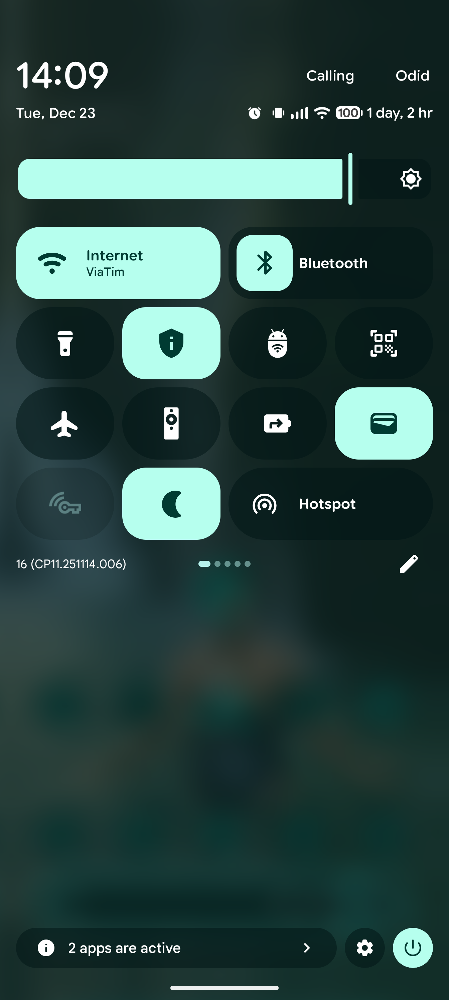
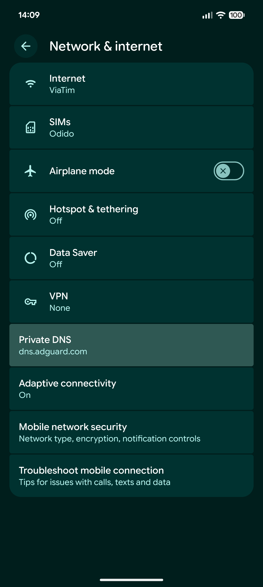

# dns_toggle

(Android) Create a quick settings tile that let's you enable/disable Adguard as a private DNS
server.

## Getting Started

After installing the application, run this command over ADB to allow the app to change system
settings:

```shell
adb shell pm grant dev.vdham.dns_toggle android.permission.WRITE_SECURE_SETTINGS
```

Open the application once to create the quick setting tile.

### Screenshots

Quick settings tile:


Quick settings tile:
